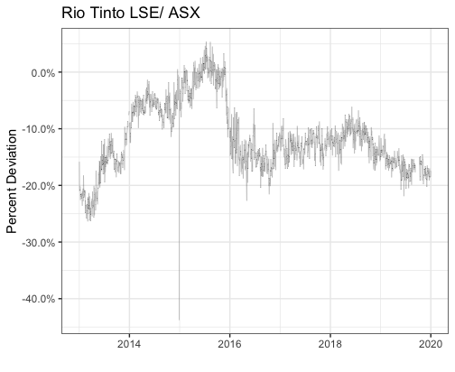
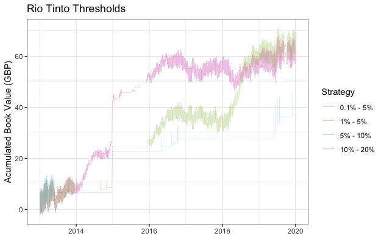
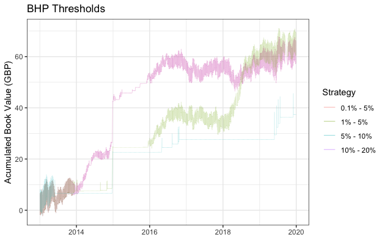
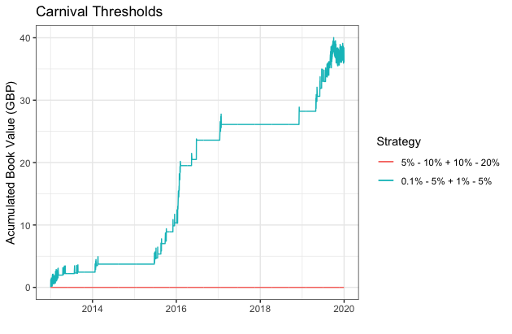
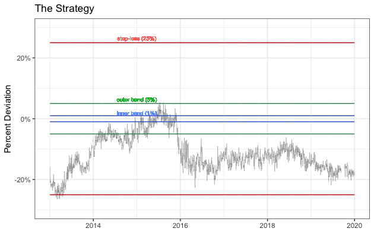
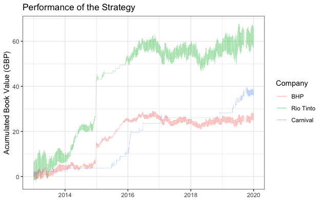

---
authors:
- admin
categories: []
date: "2020-10-20T00:00:00Z"
draft: false
featured: false
image:
  focal_point: ""
  preview_only: false
lastmod: "2020-10-21T00:00:00Z"
projects: []
subtitle: 'A statistical arbitrage strategy'
summary: 'Explore an investment strategy to capitalise on arbitrage opportunities'
title: 'Dual Listed Companies'
---

## What is a dual-listed company? 
A dual-listed company refers to two companies incorporated in different countries that agree to merge and operate as a single enterprise, maintaining separate legal identities and stock exchange listings. An example of a dual-listed company to- day is Carnival Corporation Plc being incorporated in the United States and the United Kingdom, maintaining separate stock exchange listings on the New York Stock Exchange (NYSE: CCL) and the London Stock Exchange (LSE: CCL.L).

## Case study
The main goal of the project is to explore the price relationship between companies that are dual-listed on different stock exchanges, seeking to identify any unexplained price deviations that conflict with theories of rational pricing. We have decided to utilise data from three dual-listed companies for the purposes of exploring the validity of our investment strategy, namely: Rio Tinto (ASX and LSE), Carnival Corporation (NYSE and LSE) and BHP (ASX and LSE). \
Rio Tinto was founded in 1873 and is a multinational metals and mining cor- poration that produces iron ore, copper, diamonds, gold and uranium. Rio Tinto is headquartered in London and Melbourne and is dual-listed on the London Stock Exchange and the Australian Stock Exchange. \
Carnival Corporation was founded in 1972 and is a British/American cruise op- erator with over 100 vessels and 10 cruise line brands. The company is dual-listed on the New York Stock Exchange and the London Stock Exchange. \
BHP was founded in 1885 and is a multinational mining, metals and petroleum company. The company is dual-listed on the Australian Stock Exchange and the London Stock Exchange.

## The algorithm

Follow how we created the strategy by following our code in R.

First of all we include useful libraries, e.g. tidyverse to plot our data.

```{r}
library(tidyverse)  
library(mosaic)
library(ggthemes)
library(GGally)
library(readxl)
library(here)
library(skimr)
library(janitor)
library(broom)
library(tidyquant)
library(infer)
library(openintro)
library(tidyquant)
library(xts)
library(zoo)
library(quantmod)
library(fBasics)
library(priceR)
library(dplyr)
````

The next step is downloading the historical prices for the first of our 3 companies, Rio Tinto. We download the data from 2013 to 2020 from the London Stock Exchange and the Australian Stock exchange. from Yahoo Finance. Additionaly we need the exchange rate to convert everything into GBP.

````{r}
# Rio Tinto Australia (ASX: RIO.AX)
getSymbols("RIO.AX",from="2013-01-01", to = "2020-01-01") 
rio_ASX <- data.frame(Date=index(RIO.AX), coredata(RIO.AX$RIO.AX.Close))
rio_ASX <- rename(rio_ASX, c("Close_C2" = "RIO.AX.Close"))

# Rio Tinto UK (LSE: RIO.L)
getSymbols("RIO.L",from="2013-01-01", to = "2020-01-01") 
rio_LSE <- data.frame(Date=index(RIO.L), coredata(RIO.L$RIO.L.Close)/100) #Prices in pence
rio_LSE <- rename(rio_LSE, c("Close_C1" = "RIO.L.Close"))

# Exchange rate between AUD/GBP
getSymbols("AUDGBP=X",from="2013-01-01", to = "2020-01-01")
aud_gbp <- data.frame(Date=index(`AUDGBP=X`), coredata(`AUDGBP=X`$`AUDGBP=X.Close`))
aud_gbp <- rename(aud_gbp, c("Close_C2_C1" = "AUDGBP.X.Close"))

#Merge Rio Tinto prices and exchange rate
rio <- merge(rio_LSE, rio_ASX, by = "Date")
rio <- merge(rio, aud_gbp, by = "Date")

#Compute AUD prices in GBP
rio$Change_C1_C2 <- rio$Close_C2*rio$Close_C2_C1
````

Once we have a table including both prices in GBP, we compute the ratio and the log deviation. However, we should take into account if the stocks are trading at the same ratio, i.e., if a one stock in the London stock exchange worth the same as stock in the other country where is listed. Hence, we look at the annual reports of each company to determine if the stocks are trading 1:1.

````{r}
#Compute the ratio and log deviations
rio$Ratio <- rio$Close_C1/rio$Change_C1_C2
rio$Log_deviation <- log(rio$Ratio)

#Plot log deviation for Rio Tinto
ggplot(rio, aes(x=Date)) + 
  geom_line(aes(y=rio$Log_deviation), size = 0.08) +
  theme_bw() +
  labs(x="", y="Percent Deviation", title = "Rio Tinto LSE/ ASX") + 
  scale_y_continuous(labels = scales::percent) +
  scale_x_date(limits = c(as.Date("2013-01-01"), as.Date("2020-01-01"))) +
  NULL
````



Regarding our observations on the logarithmic deviation, one stock is underpriced and the other stock is overpriced. We want to use the mispricing occasion to generate returns and create an investment strategy based on the arbitrage principle. We assume the logarithmic deviation to return to a mean-reverting level, a level of zero percent.

Hence, we decide to buy a portfolio consisting of a long position in the under- valued asset and a short position in the overvalued asset. To make a profit, we have to liquidise our portfolio and close the position at a certain point in time at which our portfolio is worth more. 
Therefore, we are looking for a specific level to buy and sell the portfolio and decide to work with the standard ad-hoc bench trading strategy. We want to set an outer band to open the position and an inner band to close the position. Thus, we generate a profit of the outer-inner band spread. Moreover, we added a third bench at 25 percent to place a stop-loss order to prevent bigger loses in case we never return to the inner band and thus, never close the position.

We create a function called strategy which displays the algorithm. 

````{r}
strategy <- function(data, buy_threshold, sell_threshold) {
  
  T <- length(data$Log_deviation)  #Number of data
  start_strategy <- FALSE         #Indicates the start of the strategy
  upper_band <- FALSE             #Indicates if the strategy start with a positive   deviation
  initial_day <- 0                #Initial day of the strategy
  final_day <- 0                  #Final day of the strategy
  long_price_0 <- 0               #Long price at t=0, i.e. when the strategy starts
  short_price_0 <- 0              #Short price at t=0
  long_price_f <- 0               #Long price at t=f, i.e. when the strategy finish
  short_price_f <- 0              #Short price at t=f
  long_position <- 0              #Total long position
  short_position <- 0             #Total short position
  maintenance_margin <- 0.25      #Maintenance margin percentage
  temp <- 0                       #Count the number of inputs in the return matrix
  acumulated_value <- 0           #Acumulated value of the positions
  results <- matrix(0, nrow = T, ncol = 5)  #Create the results matrix 
  
  for (i in 1:T) {
    if(is.na(data$Log_deviation[i]) | #Verify if there is NA
       is.na(data$Close_C1[i]) | 
       is.na(data$Change_C1_C2[i])) {
      next
    }
    else {
      if (start_strategy == FALSE) { #If the strategy is not started loop until start
        if(data$Log_deviation[i] >= buy_threshold) { #Upper bands, positive deviation. OUTER AND INER BANDS
          start_strategy <- TRUE #Set the strategy as TRUE
          initial_day <- i #Save the day when the strategy starts
          long_position <- data$Change_C1_C2[i] #Long position equals to the lower price
          short_position <- data$Close_C1[i] #Short position equals to the higher price
          results[i, 1] <- as.Date(data$Date[i])
          results[i, 2] <- long_position
          results[i, 3] <- short_position
          results[i, 4] <- short_position - long_position
          acumulated_value <- short_position - long_position + acumulated_value
          results[i, 5] <- acumulated_value
          upper_band <- TRUE #Change upper band to TRUE
        }
        else if(data$Log_deviation[i] <= -buy_threshold) { #Lower bands, negative deviation
          start_strategy <- TRUE
          initial_day <- data$Date
          long_position <- data$Close_C1[i] #Long position equals to the lower price
          short_position <- data$Change_C1_C2[i] #Short position equals to the higher price
          results[i, 1] <- as.Date(data$Date[i])
          results[i, 2] <- long_position
          results[i, 3] <- short_position
          results[i, 4] <- short_position - long_position
          acumulated_value <- short_position - long_position + acumulated_value
          results[i, 5] <- acumulated_value
          upper_band <- FALSE
        }
        else {
          results[i, 1] <- as.Date(data$Date[i])
          results[i, 2] <- 0
          results[i, 3] <- 0
          results[i, 4] <- 0
          results[i, 5] <- acumulated_value
        }
      }
      else { #The strategy already started
        if(upper_band == TRUE){ #Scenadata in the upper band
          if(data$Change_C1_C2[i] <= long_price_0*(1-maintenance_margin) | #If there is a margin call, close the position
             data$Close_C1[i] >= short_price_0*(1+maintenance_margin)) {
            start_strategy <- FALSE
            long_position <- data$Change_C1_C2[i] 
            short_position <- data$Close_C1[i]
            results[i, 1] <- as.Date(data$Date[i])
            results[i, 2] <- long_position
            results[i, 3] <- short_position
            results[i, 4] <- long_position - short_position
            acumulated_value <- long_position - short_position + acumulated_value
            results[i, 5] <- acumulated_value
            initial_day <- 0 #Restart the initial day
            next
          }
          else if(data$Log_deviation[i] <= sell_threshold) { #If the log deviation overpass the sell thershold
            start_strategy <- FALSE
            long_position <- data$Change_C1_C2[i] 
            short_position <- data$Close_C1[i]
            results[i, 1] <- as.Date(data$Date[i])
            results[i, 2] <- long_position
            results[i, 3] <- short_position
            results[i, 4] <- long_position - short_position
            acumulated_value <- long_position - short_position + acumulated_value
            results[i, 5] <- acumulated_value
            initial_day <- 0 #Restart the initial day
            next
          }
          else {
            long_position <- data$Change_C1_C2[i] 
            short_position <- data$Close_C1[i]
            results[i, 1] <- as.Date(data$Date[i])
            results[i, 2] <- long_position
            results[i, 3] <- short_position
            results[i, 4] <- long_position - short_position
            acumulated_value <- long_position - short_position + acumulated_value
            results[i, 5] <- acumulated_value
          }
        }
        else { #Scenario in the lower band
          if(data$Close_C1[i] <= long_price_0*(1-maintenance_margin) | #If there is a margin call, close the position
             data$Change_C1_C2[i] >= short_price_0*(1+maintenance_margin)) {
            start_strategy <- FALSE
            long_position <- data$Close_C1[i] 
            short_position <- data$Change_C1_C2[i]
            results[i, 1] <- as.Date(data$Date[i])
            results[i, 2] <- long_position
            results[i, 3] <- short_position
            results[i, 4] <- long_position - short_position
            acumulated_value <- long_position - short_position + acumulated_value
            results[i, 5] <- acumulated_value
            initial_day <- 0 #Restart the initial day
            next
          }
          else if(data$Log_deviation[i] >= -sell_threshold) { #If the log deviation overpass the sell threshold
            start_strategy <- FALSE
            long_position <- data$Close_C1[i] 
            short_position <- data$Change_C1_C2[i]
            results[i, 1] <- as.Date(data$Date[i])
            results[i, 2] <- long_position
            results[i, 3] <- short_position
            results[i, 4] <- long_position - short_position
            acumulated_value <- long_position - short_position + acumulated_value
            results[i, 5] <- acumulated_value
            initial_day <- 0 #Restart the initial day
            next
          }
          else {
            long_position <- data$Change_C1_C2[i] 
            short_position <- data$Close_C1[i]
            results[i, 1] <- as.Date(data$Date[i])
            results[i, 2] <- long_position
            results[i, 3] <- short_position
            results[i, 4] <- long_position - short_position
            acumulated_value <- long_position - short_position + acumulated_value
            results[i, 5] <- acumulated_value
          }
        }
      }
    }
  }
  
  
  #Redim the matrix results
  colnames(results) <- c("Date",                #Change column names
                          "Long_position", 
                          "Short_position", 
                          "Total_position",
                          "Acumulated_value") 
    
  results <- as.data.frame(results) #Convert the matrix as a data frame
  results$Date <- as.Date(results$Date)
  #Return the results
  return(results)
}
````
In order to find the best thresholds, we tried different combinations of inner and outer bands. We plotted the performance for each strategy and each dual-listed company we mentioned in section 2 (Rio Tinto, Carnival and BHP) by plotting the accumulated book value. 

````{r}
#Compute the results using the function
results_1 <- strategy(rio, 0.05, 0.001)
results_2 <- strategy(rio, 0.05, 0.01)
results_3 <- strategy(rio, 0.1, 0.05)
results_4 <- strategy(rio, 0.2, 0.1)

#Add all the results
total_results <- results_1
total_results$first <- results_1$Acumulated_value
total_results$second <- results_2$Acumulated_value
total_results$third <- results_3$Acumulated_value
total_results$fourth <- results_4$Acumulated_value

#PLOT ALL STRATEGIES
ggplot(total_results) + 
  geom_line(aes(x = Date, y=first, color = "black"), size = 0.05) +
  geom_line(aes(x= Date, y=second, color = "red"), size = 0.05) +
  geom_line(aes(x= Date, y=third, color = "blue"), size = 0.05) +
  geom_line(aes(x = Date, y=fourth, color = "green"), size = 0.05) +
  scale_color_discrete(name = "Strategy", labels = c("0.1% - 5%", "1% - 5%", "5% - 10%", "10% - 20%")) +
  theme_bw() +
  labs(x="", y="Acumulated Book Value (GBP)", title = "Rio Tinto Thresholds") + 
  scale_x_date(limits = c(as.Date("2013-01-01"), as.Date("2020-01-01"))) +
  NULL
````


In order to get reasonable results we do the same for the companies Carnival and BHP.
We downloaded the data and calculated the log deviation like for Rio Tinto. 

````{r}
#PLOT ALL STRATEGIES CARNIVAL
ggplot(c_total_results) + 
  geom_line(aes(x= Date, y=second, color = "red")) +
  geom_line(aes(x= Date, y=fourth, color = "blue")) +
  scale_color_discrete(name = "Strategy", labels = c("5% - 10% + 10% - 20%", "0.1% - 5% + 1% - 5%")) +
  theme_bw() +
  labs(x="", y="Acumulated Book Value (GBP)", title = "Carnival Thresholds") + 
  scale_x_date(limits = c(as.Date("2013-01-01"), as.Date("2020-01-01"))) +
  NULL
  
#PLOT ALL STRATEGIES BHP
ggplot(b_total_results) + 
  geom_line(aes(x = Date, y=first, color = "black"), size = 0.05) +
  geom_line(aes(x= Date, y=second, color = "red"), size = 0.05) +
  geom_line(aes(x= Date, y=third, color = "blue"), size = 0.05) +
  geom_line(aes(x = Date, y=fourth, color = "green"), size = 0.05) +
  scale_color_discrete(name = "Strategy", labels = c("0.1% - 5%", "1% - 5%", "5% - 10%", "10% - 20%")) +
  theme_bw() +
  labs(x="", y="Acumulated Book Value (GBP)", title = "BHP Thresholds") + 
  scale_x_date(limits = c(as.Date("2013-01-01"), as.Date("2020-01-01"))) +
  NULL
````





As one can see in the plots, the accumulated book value per company, the overall best performance generates the strategy with a value of 1% for the inner band and a value of 5% for the outer band (light green line for Rio Tinto and BHP, blue line for Carnival). Since the Carnival stock is in comparison to Rio Tinto and BHP not very volatile and thus, never reaches the 10% threshold, our strategy never opens a position and generates return. Hence, we focus on a strategy with smaller thresholds. For Carnival it does not make a huge difference if we choose an inner band of 0.1% or 1% because we always return to the mean-reverting level of zero after opening a position whereas the price changes are not remarkable.

The developed strategy is demonstrated below, showing the logarithmic deviation of the dual-listed company Rio Tinto, calculated by the price ratio between LSE and ASX. The graph also includes our 1% inner bands (blue) and our 5% outer bands (green).

````{r}
#Plot the log deviation for Rio Tinto with the best strategy
ggplot(rio, aes(x=Date)) + 
  geom_line(aes(y=Log_deviation), color = "black", size = 0.1) +
  geom_line(aes(y=0.05), color = "royalblue3") + #Red color is the buy threshold of 10%
  geom_line(aes(y=0.1), color = "seagreen4") + #Green color is the sell threshold of 5%
  geom_line(aes(y=-0.05), color = "royalblue3") +
  geom_line(aes(y=-0.1), color = "seagreen4") +
  geom_line(aes(y=0.25), color = "red3") +
  geom_line(aes(y=-0.25), color = "red3") +
  theme_bw() +
  labs(x="", y="Percent Deviation", title = "The Strategy") + 
  scale_y_continuous(labels = scales::percent, limits = c(-0.3, 0.3)) +
  geom_text(aes(x = as.Date("2015-01-01"), y = 0.265, label = "stop-loss (25%)", color = "red3"), size=2.5) + 
  geom_text(aes(x = as.Date("2015-01-01"), y = 0.115, label = "outer band (10%)", color = "royalblue3"), size=2.5) + 
  geom_text(aes(x = as.Date("2015-01-01"), y = 0.065, label = "inner band (5%)", color = "seagreen4"), size=2.5) + 
  theme(legend.position = "none")
  NULL
````



The analysis of the data above allows us to infer that all dual-listed firms anal- ysed, during some periods, displayed strong deviations from theoretical parity. From 2013 to 2020, the three companies combined had in 4920 occasions the log-normal of the price deviations was above 1% and in 4317 times it was above 5%. Besides, the highest price difference (BHP) amounted to 51,5%. The abundancy of these sit- uations, combined with the large magnitude of price disparity in each one of them would suggest that the application of an arbitrage strategy would be well suited from an investor’s point of view.

````{r}
#FINAL STRATEGY FOR ALL COMPANIES
results_rio <- strategy(rio, 0.1, 0.05)
results_rio <- results_rio[,-c(2:4)]
results_rio <- rename(results_rio, c("Acumulated_value_rio" = "Acumulated_value"))

results_carnival <- strategy(carnival, 0.1, 0.05)
results_carnival <- results_carnival[,-c(2:4)]
results_carnival <- rename(results_carnival, c("Acumulated_value_carnival" = "Acumulated_value"))

results_bhp <- strategy(bhp, 0.1, 0.05)
results_bhp <- results_bhp[,-c(2:4)]
results_bhp <- rename(results_bhp, c("Acumulated_value_bhp" = "Acumulated_value"))

final_results <-merge(results_2, b_results_2, by = "Date")
final_results <-merge(final_results, c_results_2, by = "Date")

#PLOT
ggplot(final_results, aes(x=Date)) + 
  geom_line(aes(y=Acumulated_value.x, color = "blue"), size = 0.08) +
  geom_line(aes(y=Acumulated_value, color = "red"), size = 0.08) +
  geom_line(aes(y=Acumulated_value.y, color = "black"), size = 0.08) +
  scale_color_discrete(name = "Company", labels = c("BHP", "Rio Tinto", "Carnival")) +
  theme_bw() +
  labs(x="", y="Acumulated Book Value (GBP)", title = "Performance of the Strategy") + 
  scale_x_date(limits = c(as.Date("2013-01-01"), as.Date("2020-01-01"))) +
  NULL

final_results <- final_results %>%
  dplyr::filter(Date >= "2013-01-01" & Date < "2020-01-01") 
````



The application of the investment strategy would provide the results illustrated in the figure "Performance of the Strategy". As shown, the use of the strategy on Rio Tinto’s dual listings would provide the best results while on BHP’s would not be as profitable. It is also worth noting that most of the capital gains would be made between 2015-2016. The reason for this is the high volatility in the stock market as a result of a big ”scary correction” of the stock prices in 2015 and 2016.

Unfortunately, and using Milton Friedman’s famous adage ”There ain’t no such thing as a free lunch”, the investment strategy is associated with its own risks. Some literature has exposed that some of the perils of engaging in this form of arbitrage are currency risk or transactions costs. Especially for a small number of shares, the transaction costs would exceed the return and therefore, the strategy would be unprofitable. These dangers would dispel arbitrageurs from these transactions, thereby making these apparent inconsistencies exist in the markets. However, a study from De Jong, Rosenthal, Van Dijk has shown that these factors are not robust enough to justify the price disparities observed.


