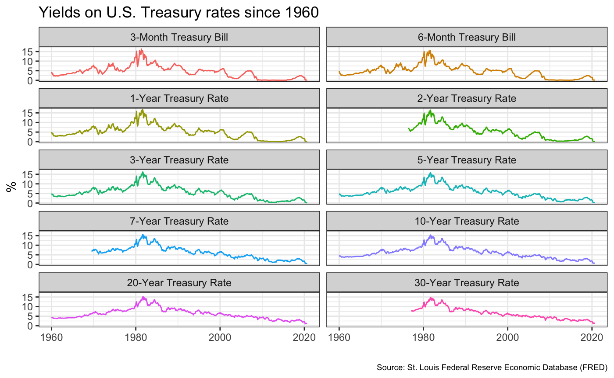
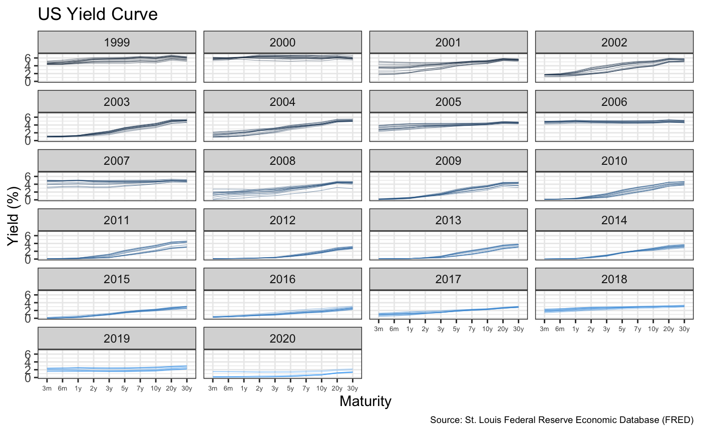
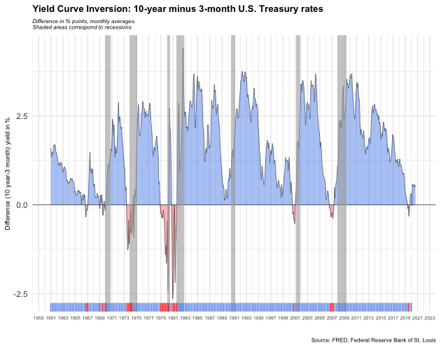

---
authors:
- admin
categories: []
date: "2020-10-21T00:00:00Z"
draft: false
featured: false
gallery_item:
- album: gallery
  caption: Default
  image: theme-default.png
- album: gallery
  caption: Ocean
  image: theme-ocean.png
- album: gallery
  caption: Forest
  image: theme-forest.png
- album: gallery
  caption: Dark
  image: theme-dark.png
- album: gallery
  caption: Apogee
  image: theme-apogee.png
- album: gallery
  caption: 1950s
  image: theme-1950s.png
- album: gallery
  caption: Coffee theme with Playfair font
  image: theme-coffee-playfair.png
- album: gallery
  caption: Strawberry
  image: theme-strawberry.png
image: 
  focal_point: ""
  preview_only: false
projects: []
subtitle: Predictive power with respect to recessions
summary: Predictive power with respect to recessions
tags: []
title: Yield curve inversion
---

Every so often, we hear warnings from commentators on the "inverted yield curve" and its predictive power with respect to recessions. An explainer what a [inverted yield curve is can be found here](https://www.reuters.com/article/us-usa-economy-yieldcurve-explainer/explainer-what-is-an-inverted-yield-curve-idUSKBN1O50GA). 

In addition, many articles and commentators think that, e.g., [*Yield curve inversion is viewed as a harbinger of recession*](https://www.bloomberg.com/news/articles/2019-08-14/u-k-yield-curve-inverts-for-first-time-since-financial-crisis). One can always doubt whether inversions are truly a harbinger of recessions, and [*use the attached parable on yield curve inversions*](https://twitter.com/5_min_macro/status/1161627360946511873).


In our case we will look at US data and use the [FRED database](https://fred.stlouisfed.org/) to download historical yield curve rates, and plot the yield curves since 1999 to see when the yield curves flatten. If you want to know more, a very nice article that explains the [yield curve is and its inversion can be found here](https://fredblog.stlouisfed.org/2018/10/the-data-behind-the-fear-of-yield-curve-inversions/). 

First, we will use the `tidyquant` package to download monthly rates for different durations. 

```{r get_rates, warning=FALSE}
# Get a list of FRED codes for US rates and US yield curve; choose monthly frequency
# to see, eg., the 3-month T-bill https://fred.stlouisfed.org/series/TB3MS
tickers <- c('TB3MS', # 3-month Treasury bill (or T-bill)
             'TB6MS', # 6-month
             'GS1',   # 1-year
             'GS2',   # 2-year, etc....
             'GS3',
             'GS5',
             'GS7',
             'GS10',
             'GS20',
             'GS30')  #.... all the way to the 30-year rate

# Turn  FRED codes to human readable variables
myvars <- c('3-Month Treasury Bill',
            '6-Month Treasury Bill',
            '1-Year Treasury Rate',
            '2-Year Treasury Rate',
            '3-Year Treasury Rate',
            '5-Year Treasury Rate',
            '7-Year Treasury Rate',
            '10-Year Treasury Rate',
            '20-Year Treasury Rate',
            '30-Year Treasury Rate')

myvars <- factor(myvars, levels = myvars)

maturity <- c('3m', '6m', '1y', '2y','3y','5y','7y','10y','20y','30y')

# by default R will sort these maturities alphabetically; but since we want
# to keep them in that exact order, we recast maturity as a factor 
# or categorical variable, with the levels defined as we want
maturity <- factor(maturity, levels = maturity)
maturity_n = c(30, 60, 90, 180, 365.25 * c(1,2,3,5,7,10,20,30))

# Create a lookup dataset
mylookup<-data.frame(symbol=tickers,var=myvars, maturity=maturity)
# Take a look:
mylookup %>% 
  knitr::kable()

df <- tickers %>% tidyquant::tq_get(get="economic.data", 
                   from="1960-01-01")   # start from January 1960

glimpse(df)
```

Our dataframe `df` has three columns (variables):

- `symbol`: the FRED database ticker symbol
- `date`: already a date object
- `price`: the actual **yield** on that date

The first thing would be to join this dataframe `df` with the dataframe `mylookup` so we have a more readable version of maturities, durations, etc.

```{r join_data, warning=FALSE}

yield_curve <-left_join(df,mylookup,by="symbol")

glimpse(yield_curve)
```

## Plotting the yield curve

### Yields on US rates by duration since 1960

```{r yield_curve_1, echo=TRUE, out.width="100%"}
ggplot(yield_curve, aes(x=date, y= price, color = var)) + 
  geom_line() + 
  facet_wrap(~var, ncol = 2) + 
  labs(title= "Yields on U.S. Treasury rates since 1960",
       y = "%",
       x= "",
       caption = "Source: St. Louis Federal Reserve Economic Database (FRED)") + 
  theme_bw() +
  theme(plot.caption =element_text(size=7)) + 
  theme(legend.position = "none") +
  NULL
```



### Monthly yields on US rates since 1999 on a year-by-year basis


```{r yield_curve_2, echo=TRUE, out.width="100%"}

# Filter data by year (1999 - 2020) and calculate monthly yield per treasury
yield_curve_2 <- yield_curve %>%
  filter (date >= "1999-01-01" & date < Sys.Date()) %>%
  group_by(year(date),month(date), maturity) %>%
  summarize(maturity, year = year(date), month = month(date), yield = mean(price)) 

  ggplot(yield_curve_2, aes(x=maturity ,y=yield, group = month, color = year)) + 
  facet_wrap(~ year, nrow = 6) + 
  geom_path(size = 0.1, alpha = 5) + 
    labs(title= "US Yield Curve",
        y = "Yield (%)",
        x= "Maturity",
        caption = "Source: St. Louis Federal Reserve Economic Database (FRED)") + 
  theme_bw() +
  theme(legend.position = "none") +
  theme(plot.caption =element_text(size=7),
        axis.text.x=element_text(size=5)) + 
  NULL

```



### Yields on 3-month and 10-year US Treasury rates since 1999

```{r yield_curve_3, echo=TRUE, out.width="100%"}

# Filter data for time (1999-2020) and yields (3m and 10y)
yield_curve_3 <- yield_curve %>%
  filter(date >= as.Date("1999-01-01"), date <= Sys.Date()) %>%
  filter (maturity == "3m" | maturity == "10y")

ggplot(yield_curve_3, aes(x=date, y= price, color = var)) + 
  geom_line() + 
  labs(title= "Yields on 3-month and 10-year US Treasury rates since 1999",
       y = "%",
       x= "",
       caption = "Source: St. Louis Federal Reserve Economic Database (FRED)") + 
  theme_bw() +
  theme(plot.caption =element_text(size=7)) + 
  theme(legend.title=element_blank()) +
  NULL
```


According to [Wikipedia's list of recession in the United States](https://en.wikipedia.org/wiki/List_of_recessions_in_the_United_States), since 1999 there have been two recession in the US: between Mar 2001–Nov 2001 and between Dec 2007–June 2009. \n
Obviously, before each of both recessions, the yield curve seems to flatten as one can see in the second graph "US Yield curve". The yield curve flattens in 2001, before the first recession due to the burst of the dotcom bubble, and in years 2006 and 2007 before the housing crisis, the second recession. As shown in the graph, a yield curve flattening can mean a recession is coming in the US. However, it is not a clear signal; the inversion of a yield curve is. \n
To get an in-deep insight on the inversion of the yield curve, we have a look at the periods, when short-term (3 months) yield are higher than longer-term (10 years) debt. As one can see in graph 3 "Yields on 3-month and 10-year US Treasury rates since 1999" 3-month yields are higher than 10 years debt before each recession. In general, the yield curve inverts 12 - 24 months before the recession occurs. 

## Yield Curve Inversion: 10-year minus 3-month 

Besides calculating the spread (10year - 3months), there are a few things we need to do to produce our final plots. 

For the first, the code below creates a dataframe with all US recessions since 1946.

```{r setup_US-recessions, warning=FALSE}

# get US recession dates after 1946 from Wikipedia 
# https://en.wikipedia.org/wiki/List_of_recessions_in_the_United_States

recessions <- tibble(
  from = c("1948-11-01", "1953-07-01", "1957-08-01", "1960-04-01", "1969-12-01", "1973-11-01", "1980-01-01","1981-07-01", "1990-07-01", "2001-03-01", "2007-12-01"),  
  to = c("1949-10-01", "1954-05-01", "1958-04-01", "1961-02-01", "1970-11-01", "1975-03-01", "1980-07-01", "1982-11-01", "1991-03-01", "2001-11-01", "2009-06-01") 
  )  %>% 
  mutate(From = ymd(from), 
         To=ymd(to),
         duration_days = To-From)

glimpse(recessions)
```


```{r yield_curve_challenge, echo=TRUE, out.width="100%"}
# Filter data for time (1999-2020) and yields (3m and 10y) and calculate difference
yield_curve_challenge <- yield_curve %>%
  group_by(date) %>%
  summarize(price_3m = price[maturity == "3m"], 
            price_10y = price[maturity == "10y"], 
            diff = price_10y - price_3m, 
            positive = ifelse(diff>0, diff,0), 
            negative = ifelse(diff <0, diff, 0))
  
# Get quarterly difference with sequence 
yield_curve_firstday <- yield_curve %>%
  group_by(date) %>%
  filter (date %in% seq(as.Date("1960-01-01"), as.Date("2020-01-01"),"3 months")) %>%
  summarize(price_3m = price[maturity == "3m"], 
            price_10y = price[maturity == "10y"], 
            diff = price_10y - price_3m, 
            positive = ifelse(diff>0, diff,0), 
            negative = ifelse(diff <0, diff, 0))
  
ggplot(yield_curve_challenge, aes(x=date, y= diff)) + 
  geom_line(size=0.2) + 
  labs(title= "Yield Curve Inversion: 10-year minus 3-month U.S. Treasury rates",
       subtitle = "Difference in % points, monthly averages. \nShaded areas correspond to recessions",
       y = "Difference (10 year-3 month) yield in %",
       x= "",
       caption = "Source: FRED, Federal Reserve Bank of St. Louis") + 
  theme_minimal()+
  theme(plot.subtitle=element_text(size=6,face="italic"),
        plot.title=element_text(size=10,face="bold"),
        plot.caption =element_text(size=6),
        axis.title.y=element_text(size=7),
        axis.text.x=element_text(size=5)) + 
  # Plot the spread between 30 years and 3 months as a blue/red ribbon,
  # based on whether the spread is positive (blue) or negative(red)
  geom_ribbon(aes(ymin=0,ymax=negative),
              fill="red",alpha=0.3) +
  geom_ribbon(aes(ymin=0,ymax=positive),
              fill="cornflowerblue",alpha=0.5) +
  geom_hline(yintercept=0, size=0.2) +
  # Superimpose recessions as the grey areas in our plot
  geom_rect(data=filter(recessions,To >= "1960-01-01" & From >= "1960-01-01"), 
            inherit.aes=F,
            aes(xmin=From, xmax=To, ymin=-Inf, ymax=+Inf), 
            fill='darkgray', alpha=0.6) +
  geom_rug(data=yield_curve_firstday, 
           aes(x = date, colour = ifelse(diff>=0,">=0","<0")), 
           inherit.aes = F) +
  scale_x_date(date_minor_breaks = "1 year") +
  scale_color_manual(values=c("red", "cornflowerblue")) +
  scale_x_date(limits = c(as.Date("1960-12-31"), as.Date("2020-12-31")), 
               date_labels = "%Y", 
               date_breaks = "2 years") + 
  theme(legend.position = "none") +
  NULL
```


