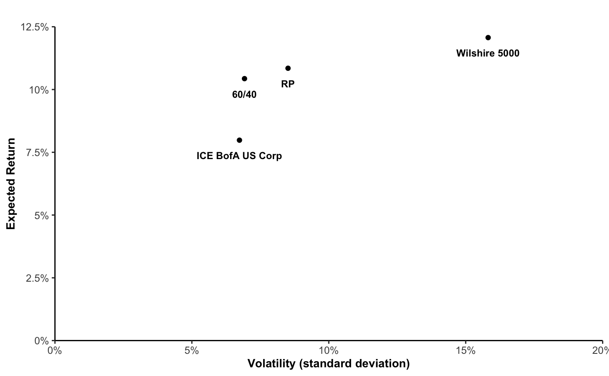

---
authors:
- admin
date: "2016-04-20T00:00:00Z"
draft: false
featured: false
gallery_item:
- album: gallery
  caption: Default
  image: theme-default.png
- album: gallery
  caption: Ocean
  image: theme-ocean.png
- album: gallery
  caption: Forest
  image: theme-forest.png
- album: gallery
  caption: Dark
  image: theme-dark.png
- album: gallery
  caption: Apogee
  image: theme-apogee.png
- album: gallery
  caption: 1950s
  image: theme-1950s.png
- album: gallery
  caption: Coffee theme with Playfair font
  image: theme-coffee-playfair.png
- album: gallery
  caption: Strawberry
  image: theme-strawberry.png
image:
  focal_point: ""
  preview_only: false
lastmod: "2020-10-21T00:00:00Z"
projects: []
subtitle: 'An alternative portfolio in financial crises'
summary: An investment portfolio that outperforms in economic recessions
title: Risk Parity
---

The traditional 60/40 portfolio – the mix of 60% equities and 40% bonds has been a mainstay of investment strategy for decades. Risk Parity is instead a much more recent asset allocation strategy. **Risk Parity** became very popular after the Great Financial Crisis, given that it performed better during the crisis than more traditional portfolios, such as 60/40. In recent years it has performed less well (see, for example, the WSJ article [“Are Risk-Parity Funds a Better Strategy for Diversification?”](https://www.wsj.com/articles/are-risk-parity-funds-a-better-strategy-for-diversification-1446805981)). But now investors wonder again if the 60/40 portfolio has a future (see, for example, the FT article [“Investors wonder if the 60/40 portfolio has a future”](https://www.ft.com/content/fdb793a4-712e-477f-9a81-7f67aefda21a)). \
\
The following assumptions are based on historical data on monthly returns from Feb 1973 – August 2020 on:

• Wilshire 5000, an index with the goal to capture the market value of all US-stocks actively traded in the United States \
\
• ICE BofA US Corporate Index value, which tracks the performance of US dollar denominated investment grade rated corporate debt publicly is- sued in the US domestic market

We will use several indices to explore 60/40 and Risk Parity in the context of MPT.
We calculated them in excel and imported a CSV-File to R to plot the results. 

```{r}
ggplot(MidTerm_Invest_1_, aes(x=SD, y=mean, label = asset)) + 
  geom_point() + 
  labs(title= "",
       y = "Expected Return",
       x= "Volatility (standard deviation)") + 
  theme_classic() +
  theme(axis.title.x = element_text(size=10, face="bold"),
axis.title.y = element_text( size=10, face="bold")
) + expand_limits(x = 0, y = 0) +
  geom_text(aes(label=asset), vjust = 0, nudge_y = -0.75, size = 3,fontface ="bold") +
  scale_y_continuous(expand = c(0,0), limits = c(0,12.5), labels = function(x) paste0(x, "%")) +
  scale_x_continuous(expand = c(0,0), limits = c(0,20), labels = function(x) paste0(x, "%")) +
  NULL
```



First of all it is obvious, that regarding the risk and return relationship portfolios perform decisively better than assets itself. For example, bonds (here: ICE BofA US Corp) and the 60/40 portfolio have the same risk but the return for the 60/40 portfolio is slightly higher (3%). Similar observation can be made for equities and the RP portfolio. They have nearly the same return but equities have a higher volatility and therefore risk (8%). To get an in-depth comparison one can have a look at the Sharpe Ratio. Indeed, this is exactly driving the attractiveness of the RP portfolio. Moreover, it is safer than a classic 60/40 portfolio as it is actually a 30/70 portfolio. Espe- cially nowadays it is more useful to invest in a 30/70 portfolio rather than a 60/40 portfolio as the equity market is very volatile and unpredictable and the performance of the 60/40 portfolio lacks.
